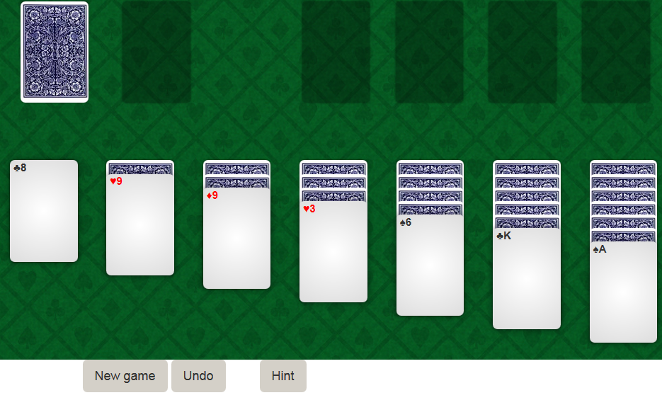

# solitaire



This is a clojurescript solitaire game built for my clojure
presentation at work. At Protacon where I work, I had the chance to
hold a presentation about a programming related subject for one of our
Lab Days. I chose Clojure, and built this game to both showcase its
code and interactive development.

I had the audience connect to the game with their mobile devices and
laptops, and would synchronize the changes in my editor to all their
clients simultaneously with figwheel. It was awesome and went pretty
well.

See the game in action [here](http://rawgit.com/sp3ctum/solitaire/master/resources/public/index.html).

## Features
- move cards by first selecting (clicking) a card place, then
  selecting the place you want to move the cards to. The game will
  move as many cards to that place as it can.
- double click to move a card to the first available place automatically
- there is a history of 10 moves - click "Undo" to go back and fix
  your mistakes!
- tests are not available in the production build, sorry :)
- oh, nothing special currently happens if you finish the game

## Reflection: my goals and outcome

**Implement the core game logic in cljc and see if it integrates to
the build process more nicely than the old cljx did**

I had done one project with cljx, which is the old way of sharing clj
and cljs code, before. In that project I had the logic implemented in
cljx and compiled to clojurescript. In that case I ran the tests on
the clojure side only, and while it worked okay, setting it up was a
pain, and mentally grasping it was difficult too.

I was happy to notice cljc has much better support. This time I
compiled the tests into clojurescript and created a view that only
runs the tests. The benefit of this was that I was able to have my
mobile phone as a dedicated test runner / build monitor while I coded
on my desktop computer. Awesome!

Another way to run the tests was on the desktop I code on: I had the
favicon of the tests page display 
when the tests pass, and a 
when they failed. This way I would notice the tests failing in another
browser tab too.

I am happy with the tests for the core logic, but I still ended up
with a lot of code that is clojurescript only, and has no tests at
all. This untested core would occasionally break, and in retrospect I
should have implemented tests for it too.

**Create and use a working build environment for both development and
releasing, with an interactive, reloading REPL and a minified build
output.**

This I had attempted with the leiningen template called `chestnut`
earlier. It had some bugs that I cannot remember any more, but this
time I used the default figwheel template and it worked out of the
box. Lesson learned: start simple.

**Get something nice done with css**

I desperately need some battle experience with css. I'm quite pleased
with the outcome. Bootstrap's grid I was familiar with when I started,
and I sort of tried things out as I progressed, without a clear
plan. Figwheel was an immense help as it reloaded my styles and layout
without restarting my game state.

**Use core.async channels in the game loop**

I knew the basics of core.async when I started, but hadn't realized
how versatile it really was. I had thought it could only be used for
communication between the view and the view model (if you could call
it that), but I found unexpected uses for it. Like restarting my game
loop by writing something to a "kill the game loop" channel.

**Have a desktop & mobile drag and drop**

This I kind of lost interest in. It seems these kinds of things are
not that easily done on mobile devices, so I spent little time in
experimenting with it. Instead I implemented a scheme where the user
should click on a source and target "card place" and the game will
just attempt to move as many cards as it could.

While this works for most cases it definitely is not the same thing as
being able to move any card in the card place to another place.

## Setup

To get an interactive development environment run:

    lein figwheel

and open your browser at [localhost:3449](http://localhost:3449/).
This will auto compile and send all changes to the browser without the
need to reload. After the compilation process is complete, you will
get a Browser Connected REPL. An easy way to try it is:

    (js/alert "Am I connected?")

and you should see an alert in the browser window.

To get connect cider (in emacs) to this repl, do `cider-connect` to
port 7888. This connects to figwheel's environment, a clojure repl. To
connect to the cljs repl, see dev.cljs. It does this, namely:

```lisp
(do
  (use 'figwheel-sidecar.repl-api)
  (cljs-repl))
```

You have to eval those in the repl buffer, not inline. It doesn't work
for some reason.

---

To clean all compiled files:

    lein clean

To create a production build run:

    lein cljsbuild once min

And open your browser in `resources/public/index.html`. You will not
get live reloading, nor a REPL. 

## License

Copyright © 2015 Mika Vilpas

Distributed under the Eclipse Public License either version 1.0 or (at your option) any later version.
